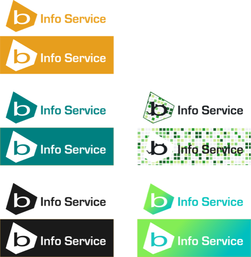

# Logo B Info Service

Travail sur le logo B Info Service.

## Prérequis

Tous les logos ont été créés à l'aide du logiciel [Inkscape](https://inkscape.org) qui permet de créer des images vectorielles (fichiers .svg).

## Versions

Nous utilisons [SemVer](http://semver.org/) pour le versionnement. Pour les versions diponibles, voir les [tags sur ce dépôt](https://github.com/BInfoService/Logo/tags). 

## Auteur

* **Bruno Boissonnet** - [Boissonnfive](https://github.com/boissonnfive)

